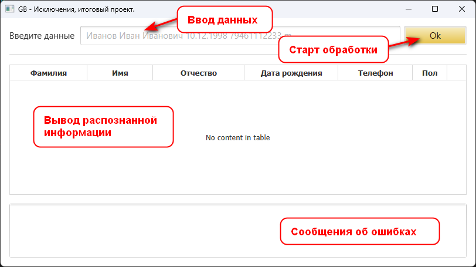

# Исключения в программировании и их обработка.

## Содержание

1. [Продвинутая работа с исключениями в Java. Постановка задачи.](#topic1)
2. [Описание общего алгоритма работы программы.](#topic2)
3. [Интерфейс пользователя.](#topic3)
4. [Тестовые данные.](#topic4)
5. [Примеры работы программы.](#topic5)

## Продвинутая работа с исключениями в Java. Постановка задачи. 

Напишите приложение, которое будет запрашивать у пользователя следующие данные в произвольном порядке, разделенные пробелом: 
Фамилия Имя Отчество датарождения номертелефона пол

Форматы данных:
+ фамилия, имя, отчество - строки
+ дата_рождения - строка формата dd.mm.yyyy
+ номер_телефона - целое беззнаковое число без форматирования
+ пол - символ латиницей f или m.

Приложение должно проверить введенные данные по количеству. Если количество не совпадает с требуемым, вернуть код ошибки, обработать его и показать пользователю сообщение, что он ввел меньше и больше данных, чем требуется.

Приложение должно попытаться распарсить полученные значения и выделить из них требуемые параметры. Если форматы данных не совпадают, нужно бросить исключение, соответствующее типу проблемы. Можно использовать встроенные типы java и создать свои. Исключение должно быть корректно обработано, пользователю выведено сообщение с информацией, что именно неверно.

Если всё введено и обработано верно, должен создаться файл с названием, равным фамилии, в него в одну строку должны записаться полученные данные, вида: 
<Фамилия><Имя><Отчество><датарождения><номертелефона><пол>

Однофамильцы должны записаться в один и тот же файл, в отдельные строки.

Не забудьте закрыть соединение с файлом.

При возникновении проблемы с чтением-записью в файл, исключение должно быть корректно обработано, пользователь должен увидеть стектрейс ошибки.

---

## Описание общего алгоритма работы программы. 

Реализация приложения с применением JavaFX. Управление проектом - Maven.

При парсинге строки введенной пользователем проводится проверка на соответствие количества переданных параметров количеству требуемых данных. После проверки соответствия, каждый параметр проверяется на соответствие какому-либо из форматов с помощью регулярных выражений. Система имеет собственный полный набор регулярных выражений, при необходимости выражения можно задать при создании сервиса по обработке строк данных. Если параметр подходит - заполняется соответствующий атрибут pojo класса данных. После проводится проверка заполненности данных класса. 
В случае несоответствия количества параметров или отсутствия какого-либо параметра выбрасывается ParsingDataExceptions.

Информация о возникшей исключительной ситуации отображается в специальном поле лога ошибок формы взаимодействия с пользователем.
Приложение обрабатывает IOExceptions. Информация о данных исключениях отображается в поле лога ошибок.

Распознанная информация сохраняется в текстовые файлы в каталог saving, а также отображается в таблице данных.

---

## Интерфейс пользователя. 

---

## Тестовые данные. 

Иванов 78964561280 Иван Иванович M 14.09.1998 
Иванов 78964561280 Иван Иванович M 14.09.1998 паспорт 
Иванов Сергей 78964541281 Михайлович 14.09.1998 m 
Иванова 73964061480 Мария 19.11.1998 Петровна f 
Фролов Семен Васильевич 78964561280 Иванович M 14.09.1998 
Фролов Семен Васильевич 78964561280 M 14.29.1998 
Камкова 78964561280 Станислава Ивановна F 24.11.1999 

---

## Примеры работы программы. 

---
